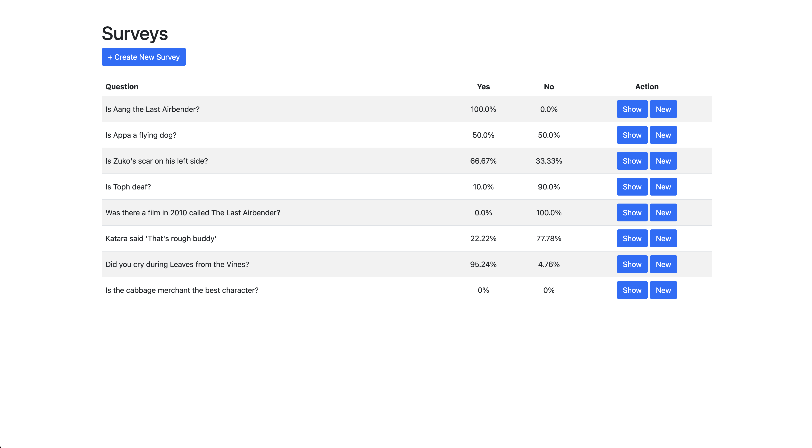

# Survey Tool

This is a simple survey tool built with Ruby on Rails. It allows users to create surveys with a single yes/no question, respond to surveys, and view the results of the surveys.



## Requirements

- Ruby 3.2
- Rails 7.1.2
- SQLite

## Getting Started

These instructions will get you a copy of the project up and running on your local machine for development and testing purposes.

### Prerequisites

You need to have Ruby 3.2 and Rails 7.1.2 installed on your machine. You can check your version with:

```bash
ruby -v
rails -v
```

If you don't have Ruby and Rails installed, you can follow this [guide](https://guides.rubyonrails.org/getting_started.html#installing-rails).


### Installation

A step by step series of examples that tell you how to get a development environment running.

1. Clone the repo
2. Install dependencies
```bash
bundle install
```
3. Database creation
```bash
rails db:create
```
4. Database initialization
```bash
rails db:migrate
```
5. Database seeding (optional)
```bash
rails db:seed
```
6. Run the Rails app
```bash
rails s
```
7. Navigate to `localhost:3000` or `localhost:3000/surveys` on your browser. You should see the following

Insert picture of home page

## Testing

To run tests, run the following
```bash
RAILS_ENV=test bin/rails db:migrate
rails test
```

All tests should run and thus giving the following output

```
# Running:

...........

Finished in 0.621563s, 40.2212 runs/s, 122.2724 assertions/s.
25 runs, 76 assertions, 0 failures, 0 errors, 0 skips
```


## Features

https://github.com/stevengov/survey_tool/assets/44922197/56571850-93dd-4455-bea2-6adfbe52bba4

Survey Tool has the following features

```
Please use Rails to build a simple survey tool, with the following requirements:
- A user should be able to create any number of surveys
- A survey consists of one question represented as a single string. The answer to the question is always Yes or No.
- The home screen of your app should show a list of surveys and a button to create a new one
- A user can respond to a survey by clicking into it from the list mentioned above
- A survey can be answered multiple times with a yes/no response
- You should keep track of when each of the survey responses are saved 
- You should display the results of the survey on the home screen with the percentage of yes and no responses.
```

<details><summary>Creating a new `survey`</summary>

https://github.com/stevengov/survey_tool/assets/44922197/e9ef7f27-89b5-447a-9ce1-2feae15cf7de

</details>

<details><summary>Responding to a `survey`</summary>

https://github.com/stevengov/survey_tool/assets/44922197/a8b83114-ea49-4224-8d82-4997e1bc7aef

</details>

<details><summary>Showing `responses` of a `survey`</summary>

https://github.com/stevengov/survey_tool/assets/44922197/c848f1b0-54d7-436c-8155-6a802a6807c0

</details>

## Future

### Authentication

As the instructions for this assignment states

> You don't need to worry about user authentication but you may stub this out if you wish

One solution is to use the [Devise](https://github.com/heartcombo/devise) gem, a popular authentication solution for Rails. This will handle user registration, login/logout, password resets, and more.

The following section will contain details on how I would create my own user authentication.


#### User Table

We would create a `users` table that has a `email: string` and `password_digest: string`.

#### User Registration

We would create a controller that handles displaying a registration form.

Additionally, Rails has a `has_secure_password` method where we can handle password encryptions. We will use that and define that in the `User` model. 

#### User Sessions

We also need to manage the session so that we can keep track of the users that are logged-in.

This involves using `Rails.application.config.session_store :cookie_store` and create a `SessionsController`. This will be for login and logout functionalities.

#### Authentication Controller

We should only allow authenticated users to hit endpoints. To do this, we can define a `AuthenticatedController`. This controller will handle authenticating the user.

Here's a basic authentication function

```ruby
def authenticate_user
  unless current_user
    render json: { message: 'Unauthorized' }, status: :unauthorized
  end
end

def current_user
  @current_user ||= User.find_by(id: session[:user_id])
end
```

For views, we can do the following instead

```ruby
def authenticate_user
  unless current_user
    flash[:alert] = 'Unauthorized. Please log in'
    redirect_to login_path
  end
end

def current_user
  @current_user ||= User.find_by(id: session[:user_id])
end
```

From there, we can add it to each of the controllers! Essentially, we need this

```ruby
append_before_action :authenticate_user
```


#### New Database schema

With the creation of the a new `users` table, we can add some new associations
- A `user` has many surveys, which means a `survey` belongs to a `user`
- A `user` has many responses to surveys, which means a `response` belongs to a `user`

We can add some `uniqueness` validations throughout the app
- A `user` can only create a `survey` with a unique name.
- A `user` can only respond to a `survey` once
